# 🛒 SmartCart – Full Stack E-Commerce Application

SmartCart is a full-stack e-commerce web application that simulates a real-world online shopping system with **User and Admin panels**. The platform enables seamless product browsing, order management, and inventory control with a structured and scalable architecture.

---

## 🌐 Live Demo

🔗 [https://your-pythonanywhere-link.com](https://harshithaa10.pythonanywhere.com/)  

> 💡 Includes complete user workflow: authentication → product browsing → cart → payment → order tracking

---

## 🚀 Key Features

### 👤 User Panel
- User authentication (Login & Registration)
- Browse products with category-based filtering
- Add to cart and manage cart items
- Place orders with end-to-end checkout flow
- Responsive UI for smooth user experience

---

### 🛠️ Admin Panel
- Secure admin authentication system
- Dashboard with key metrics (Products, Orders, Revenue, Users)
- Full CRUD operations for product management
- Product search, filtering, and inventory tracking
- Admin profile management

---

## 🛠️ Tech Stack

- **Frontend:** HTML5, CSS3, JavaScript, Bootstrap5  
- **Backend:** Python (Flask), RESTful APIs  
- **Database:** SQLite3  
- **Tools:** Git, GitHub, Postman  
- **Deployment:** PythonAnywhere  

---

## ⚡ Project Highlights

- Developed a **full-stack e-commerce system** with separate user and admin workflows  
- Designed and implemented **15+ RESTful APIs** for authentication, product, and order management  
- Built a **role-based access system** (Admin vs User) ensuring secure operations  
- Created an **admin dashboard** to monitor business metrics and platform activity  
- Implemented **end-to-end CRUD functionality** for product and inventory management  
- Structured a relational database for **efficient data storage and retrieval**  

---

## 📊 Impact

- Managed **25+ products and 20+ orders** through admin operations  
- Generated **₹2.8L+ simulated revenue** via dashboard tracking  
- Enabled **real-time product and inventory updates**, improving operational efficiency  
- Built a scalable system supporting **multiple users and admin interactions**  

---

## 📂 Project Structure

```
SmartCart_sqlite3/
│── screenshots/
│── static/
│── templates/
│── utils/
│── app.py
│── config.py
│── init_db.py
│── schema.sql
│── smartcart1.db
```

---

## ⚙️ Installation & Setup

### 1️⃣ Clone the repository

```bash
git clone https://github.com/harshithaadicherla10/SmartCart_sqlite3.git
cd SmartCart_sqlite3
```

### 2️⃣ Create virtual environment

```bash
python -m venv venv
venv\Scripts\activate   # Windows
```

### 3️⃣ Install dependencies

```bash
pip install flask
```

### 4️⃣ Initialize database

```bash
python init_db.py
```

### 5️⃣ Run the application

```bash
python app.py
```

👉 Open in browser:

```
http://127.0.0.1:5000/
```

## 🖼️ Screenshots

### 👤User Panel

### User Login
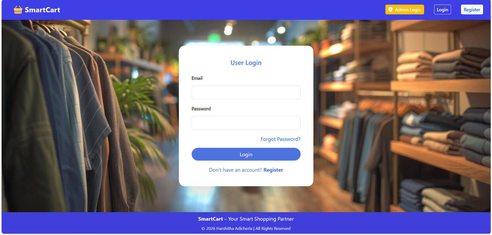
### User Register
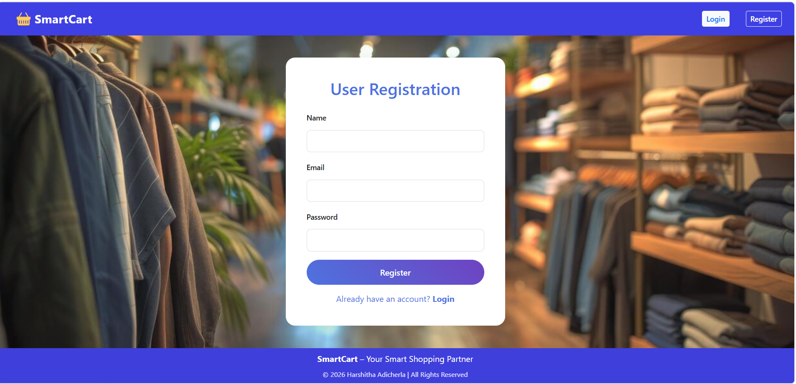
### User Dashboard
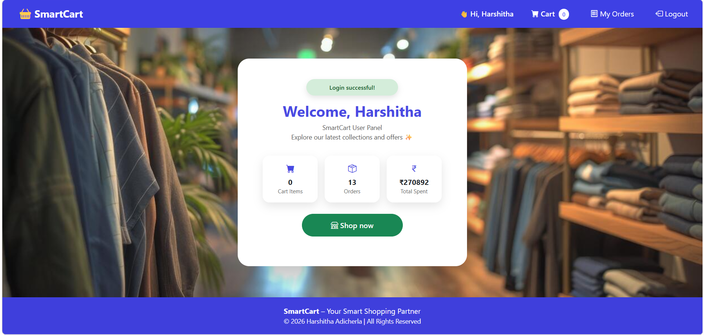
### Browse Products
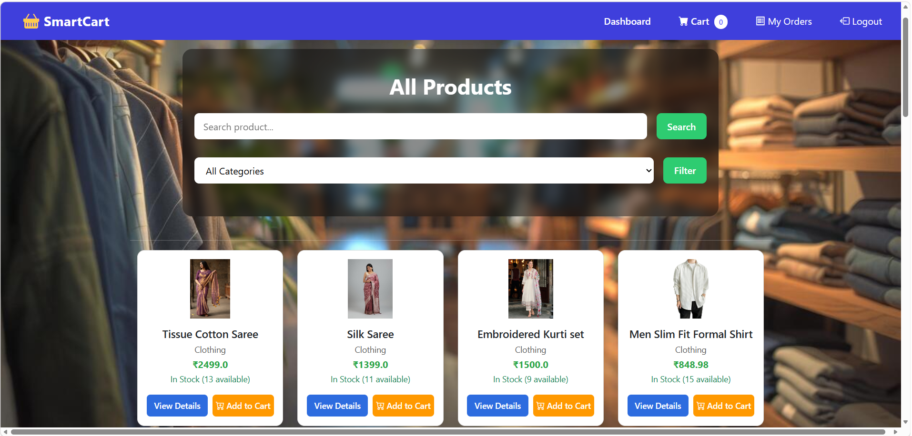
### Product Details
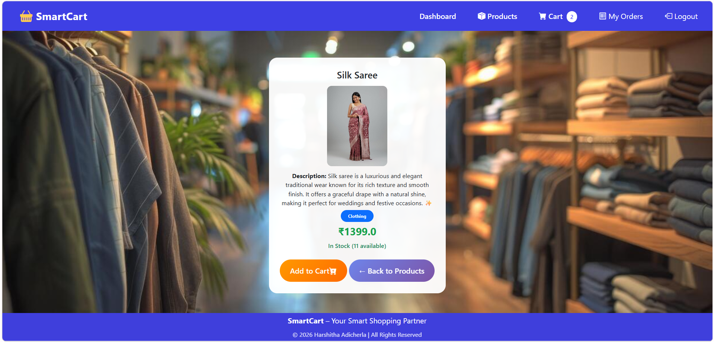
### Cart
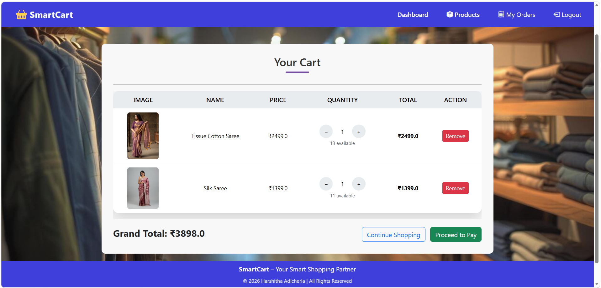
### Address Selection
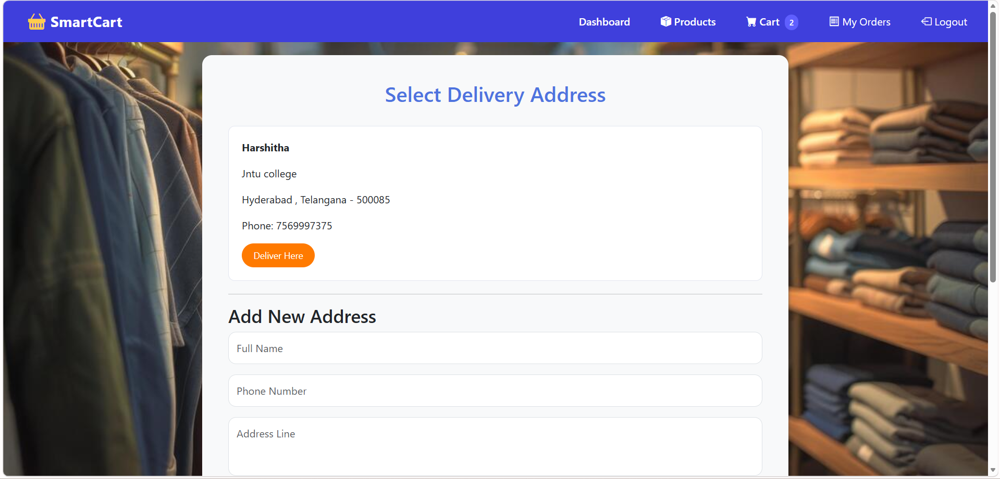
### Payment
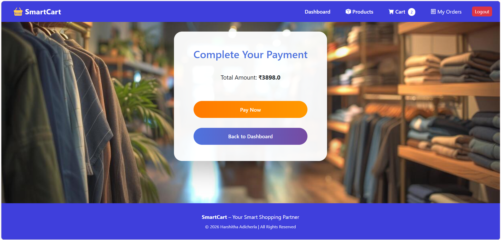
### Payment Gateway
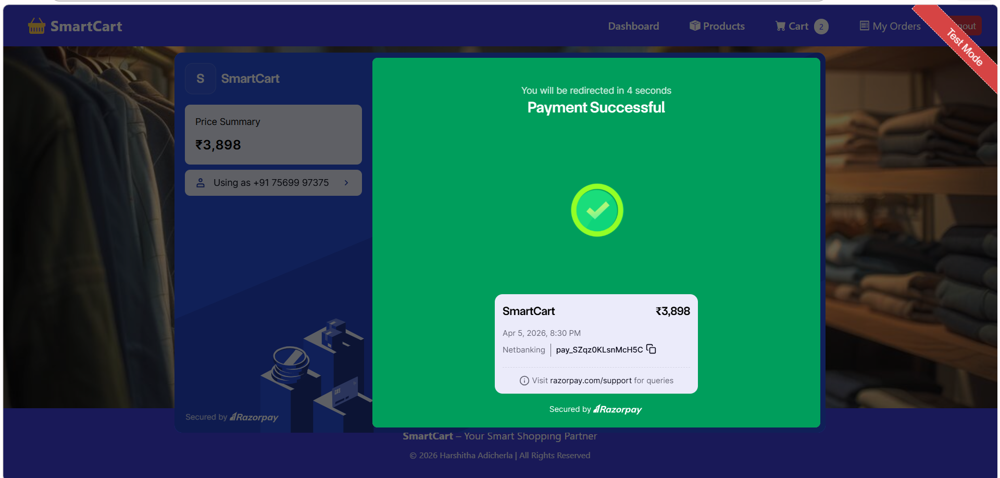
### Order Confirmation
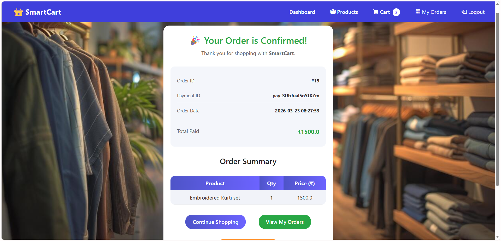
### My Orders
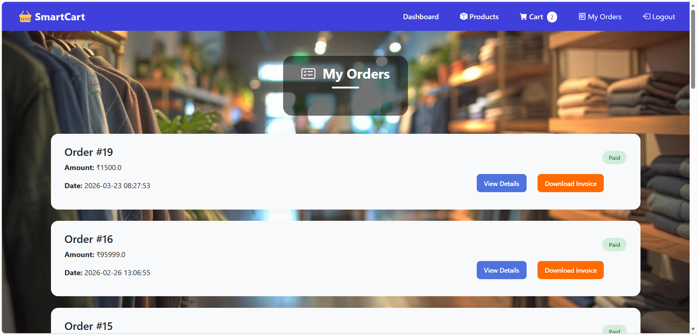

---

### 🛠️Admin Panel

### Admin Login
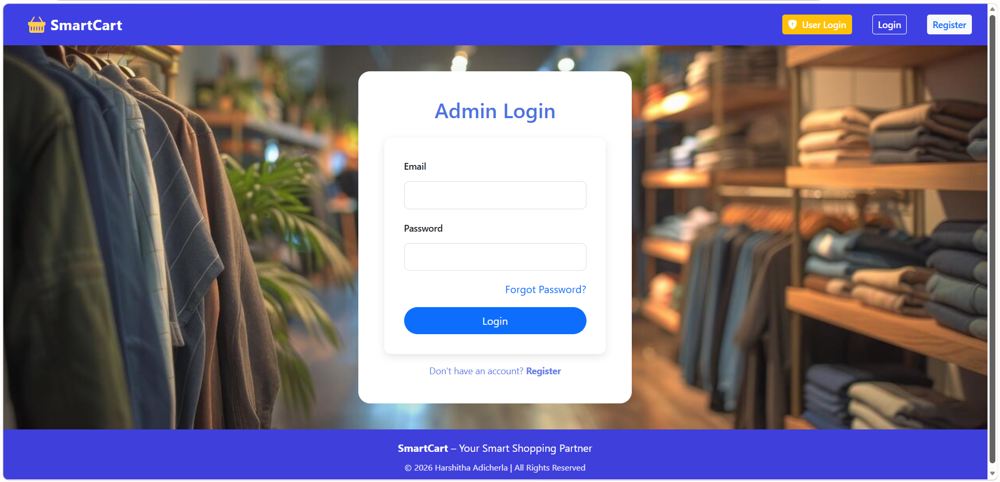
### Admin Dashboard
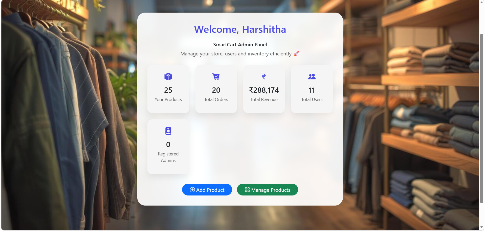
### Product List
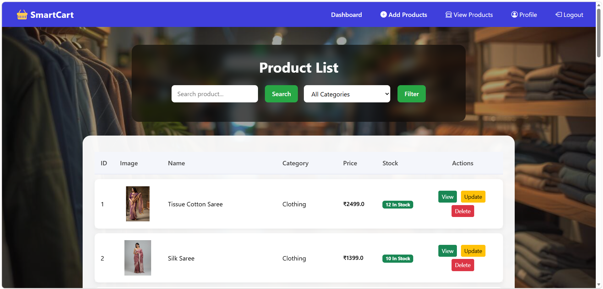
### Add Product
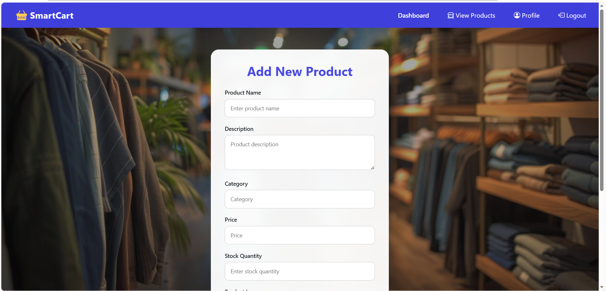
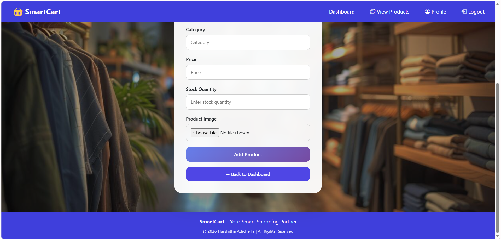
### Update Product
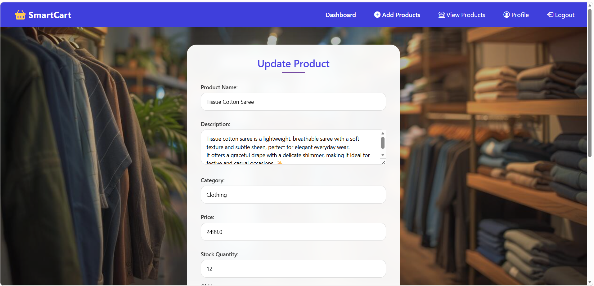
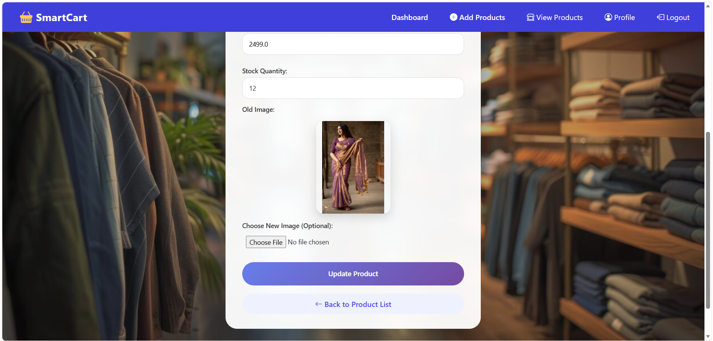
### Admin Profile
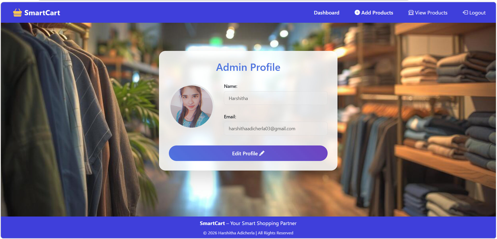

---

## 🌱 Future Enhancements

* Payment gateway integration (Razorpay/Stripe)
* Order tracking system
* Email notifications
* Advanced analytics dashboard

---

## 👩‍💻 Author

**Harshitha Adicherla**
📩 harshithaadicherla03@gmail.com
* GitHub: https://github.com/harshithaadicherla10
* LinkedIn: https://linkedin.com/in/harshithaadicherla10

---

## ⭐ If you found this project useful, consider giving it a star!
